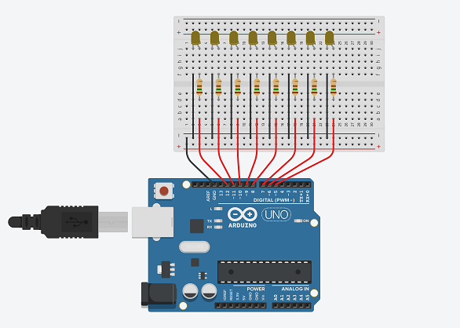

# **Projeto**: Contador Binário (Arduino)
Este projeto implementa um *contador binário* que pode ser adaptado para quantos bits o usuário deseja utilizar, sendo necessário apenas alterar uma pequena parte do código (sem precisar se envolver no processo lógico em si) e adaptando a montagem do circuito para a quantidade de bits escolhida.  

## O código:
A área de alteração está logo no início do código:
- **Quantidade de bits**: deve ser especificada na constante *QUANT_BITS*.
   - **Portas dos bits**: no vetor *pin_bit* devem ser especificadas as portas de cada bit do menos significativo (LSB) para o mais significativo (MSB).
- **Tempo de troca**: A variável *time* recebe o tempo de troca de um número para outro, em segundos. 
~~~
#define QUANT_BITS 8 
byte pin_bit[QUANT_BITS] = {5, 6, 7, 8, 9, 10, 11, 12}; 
float time = 0.5
~~~

## Esquema de Conexões:
Obs.: recomendável utilizar resistores de 150 Ohm (Ω) ou superiores para leds comuns!

Feito com [Tinkercad](www.tinkercad.com)
